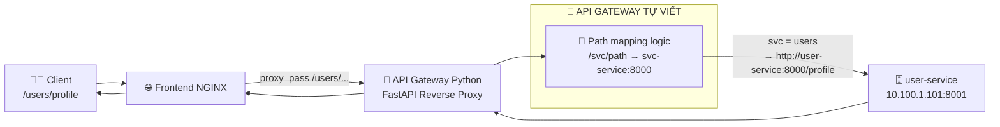

# Deploy applications:
```
docker compose up -d --build
```

# Mô hình application :

```mermaid
flowchart LR
    C[🧑‍💻 Client<br/>/users/profile] --> FE[🌐 Frontend NGINX]

    FE -->|proxy_pass /users/...| GW[🚪 API Gateway Python<br/>FastAPI Reverse Proxy]

    subgraph GATEWAY[🚪 API GATEWAY TỰ VIẾT]
        DIR[📌 Path mapping logic<br/>/svc/path → svc-service:8000]
    end

    GW --> DIR

    DIR -->|svc = users<br/>→ http://user-service:8000/profile| US[🗄️ user-service<br/>10.100.1.101:8001]

    US --> GW --> FE --> C

```