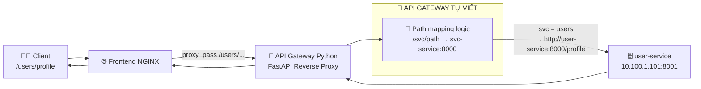

# Deploy applications:
```
docker compose up -d --build
```

# Mô hình application :

Cứ mỗi 15 giây, Prometheus sẽ tự chạy đi kéo dữ liệu từ Node Exporter và cAdvisor về


Uptime Kuma liên tục ping vào link http://10.1.10.23:3000 (Frontend) cứ mỗi 1 phút.
docker stop minibattle-frontend-1 - Kuma phát hiện dịch vụ sập - Ngay lập tức gửi cảnh báo đến điện thoại qua Telegram Bot.


