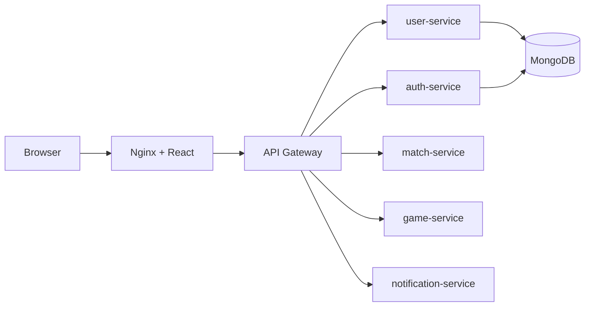

# MiniBattle Runbook

Runbook này dùng cho lab DevOps của project MiniBattle. Mục tiêu là giúp bạn chạy, kiểm tra, debug và rollback stack một cách có quy trình.

## 1. Tổng quan hệ thống

MiniBattle gồm các thành phần chính:

- `frontend`: React app được serve bởi Nginx, expose ra host qua port `3000`.
- `api-gateway`: FastAPI reverse proxy, expose ra host qua port `8000`.
- `user-service`: đăng ký user, dùng MongoDB.
- `auth-service`: đăng nhập, trả JWT, dùng MongoDB.
- `match-service`: matchmaking in-memory.
- `game-service`: battle state in-memory.
- `chat-service`: WebSocket chat in-memory.
- `notification-service`: notification log in-memory.
- `mongo`: database cho user/auth.

Luồng request chính:



## 2. Chuẩn bị môi trường

Yêu cầu:

- Docker Desktop hoặc Docker Engine
- Docker Compose v2
- Git

Tạo file env local:

```bash
cp .env.example .env
```

Trên Windows PowerShell:

```powershell
Copy-Item .env.example .env
```

Đổi `JWT_SECRET` trong `.env` thành giá trị dài và khó đoán nếu chạy ngoài máy local.

## 3. Start stack

```bash
docker compose up -d --build
```

Kiểm tra container:

```bash
docker compose ps
```

Xem log toàn bộ stack:

```bash
docker compose logs -f
```

Xem log một service:

```bash
docker compose logs -f api-gateway
docker compose logs -f auth-service
docker compose logs -f user-service
```

## 4. Smoke test cơ bản

Mở frontend:

```text
http://localhost:3000
```

Kiểm tra API gateway có route tới service:

```bash
curl -X POST "http://localhost:8000/users/register" \
  -H "Content-Type: application/json" \
  -d '{"username":"demo","password":"demo123"}'
```

```bash
curl -X POST "http://localhost:8000/auth/login" \
  -H "Content-Type: application/json" \
  -d '{"username":"demo","password":"demo123"}'
```

```bash
curl -X POST "http://localhost:8000/match/match/join?username=demo"
```

Kỳ vọng:

- Register trả về `id` và `username`.
- Login trả về `access_token`.
- Match trả về `Waiting for opponent` hoặc `match_id` khi có đủ 2 player.

## 5. Stop, restart, rebuild

Stop stack:

```bash
docker compose down
```

Stop và xóa volume Mongo:

```bash
docker compose down -v
```

Restart service:

```bash
docker compose restart api-gateway
```

Rebuild một service:

```bash
docker compose up -d --build api-gateway
```

## 6. Debug nhanh theo triệu chứng

### Frontend không mở được

Kiểm tra:

```bash
docker compose ps frontend
docker compose logs frontend
```

Nguyên nhân thường gặp:

- Port `3000` trên host đang bị dùng.
- Nginx config lỗi.
- Build React lỗi.

### API trả 502/500 hoặc không gọi được service

Kiểm tra:

```bash
docker compose ps api-gateway
docker compose logs api-gateway
docker compose ps user-service auth-service match-service game-service
```

Nguyên nhân thường gặp:

- Service đích chưa start xong.
- Tên service trong gateway không khớp Docker Compose DNS.
- Endpoint frontend gọi bị sai prefix.

### Register/Login lỗi

Kiểm tra:

```bash
docker compose ps mongo
docker compose logs mongo
docker compose logs user-service
docker compose logs auth-service
```

Nguyên nhân thường gặp:

- Mongo chưa sẵn sàng.
- `MONGO_URL` sai.
- User đã tồn tại.

### Battle báo invalid turn

Nguyên nhân hiện tại:

- `game-service` cần có game state trước khi gọi `/game/action`.
- Frontend hiện chỉ gọi action, chưa gọi `/game/start`.

Hướng xử lý lab:

- Thêm bước start game sau khi matchmaking thành công.
- Hoặc thêm logic auto-create game trong `game-service`.

### Chat không hoạt động

Nguyên nhân hiện tại:

- Frontend đang dùng hardcoded WebSocket URL `ws://localhost:8000/chat/ws/chat`.
- API Gateway hiện chưa map service `chat`.
- Nginx hiện chưa có `location /chat/`.

Hướng xử lý lab:

- Thêm route `chat` vào gateway.
- Thêm `location /chat/` vào Nginx.
- Sửa frontend dùng same-origin WebSocket thay vì hardcode `localhost`.

## 7. Backup và restore Mongo

Backup:

```bash
docker compose exec mongo mongodump --db minibattle --out /tmp/backup
docker compose cp mongo:/tmp/backup ./backup
```

Restore:

```bash
docker compose cp ./backup mongo:/tmp/backup
docker compose exec mongo mongorestore --drop --db minibattle /tmp/backup/minibattle
```

## 8. Rollback thủ công

Với Docker Compose local:

1. Ghi lại commit/image tag đang chạy trước khi deploy.
2. Nếu bản mới lỗi, checkout lại commit cũ hoặc dùng image tag cũ.
3. Rebuild/redeploy:

```bash
docker compose up -d --build
```

4. Chạy smoke test lại.

## 9. Checklist trước khi coi là pass Level 1

- Stack chạy được bằng một lệnh `docker compose up -d --build`.
- Frontend mở được ở `http://localhost:3000`.
- Register/login hoạt động và dữ liệu còn sau khi restart container.
- Log service đọc được bằng `docker compose logs`.
- Có `.env` local, không hardcode secret thật vào repo.
- Có healthcheck hoặc ít nhất endpoint `/health` cho các service.
- Có smoke test thủ công hoặc script đơn giản.
- Có ghi chú các known issues: chat routing, game start, state in-memory.
